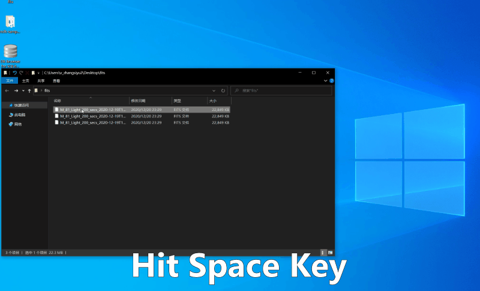

# QuickLook.Plugin.FitsViewer

FITS image Plugin for QL-win, featuring 
- auto debayer if needed
- auto stretch, producing similar image as PI
- FITS header available via the little info icon on the top-right corner

## Typical usecases
* in the field: experiment exposure/gain combination 
* post: primary sub rejection for things like satelite trails and bad tracking

## Install
A short video demo & instruction is available [here](https://youtu.be/oMexMV3Yx3E)
1. Download and run QuickLook for windows [here](https://github.com/QL-Win/QuickLook)
2. Grab the latest [release file](https://github.com/siyu6974/QuickLook.Plugin.FitsViewer/releases/)
3. Find the file you just downloaded in the File Explorer, for example "QuickLook.Plugin.FitsViewer.qlplugin"
4. Select it and then hit the space key, click "click here to install this plugin"
5. Restart QuickLook
6. Enjoy, try hit the space key on a FITS file

## Develop
The core of this plugin is a C++ DLL that 
1. Calls CCfits (which depends on cfitio, of course) to read FITS files
2. Debayers the image using super pixel algorithem
3. Applys auto-stretching

The Standalone viewer project is mainly for debug purpose, its files are copy-pasted from/to the main plugin project.

To build a plugin that works with both x86 and x64 arch, be sure to use `batch build` under the `Build` tab in VS.

## License

LGPL License.

## Demo

